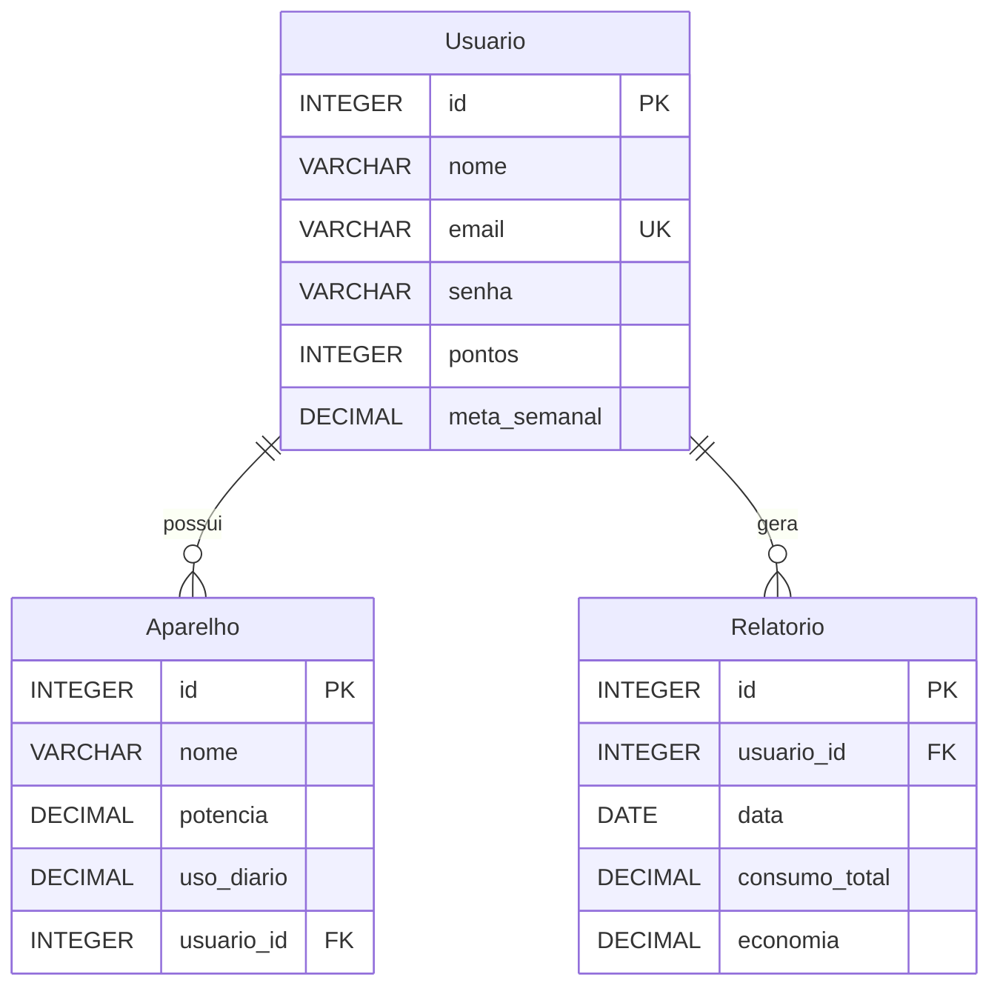

# EcoMonitor
**IAB SOLUTIONS**
**Alexandre Aguiar Martins - RM 93278**
**Bruno do Nascimento - RM 94830**
**Isac de Vietro - RM 93513**

**EcoMonitor** é um aplicativo móvel desenvolvido com **Flutter** que permite aos usuários monitorar e gerenciar seu consumo de energia doméstica. Além de registrar e listar aparelhos elétricos, o aplicativo gera relatórios semanais detalhados e permite aos usuários definir metas de consumo para promover a sustentabilidade e economia de energia.

## Sumário

1. [Pré-requisitos](#pré-requisitos)
2. [Instalação](#instalação)
3. [Uso](#uso)
4. [Justificativa das Escolhas Técnicas](#justificativa-das-escolhas-técnicas)

## Pré-requisitos

Antes de executar o **EcoMonitor**, certifique-se de ter instalado:

- **Flutter SDK:** [Instalação do Flutter](https://flutter.dev/docs/get-started/install)
- **Dart SDK:** Incluído no Flutter.
- **Android Studio ou Visual Studio Code:** Com os plugins Flutter e Dart instalados.
- **Dispositivo Android ou Emulador:** Para rodar e testar o aplicativo.

## Instalação

1. **Clonar o Repositório:**

   ```bash
   git clone https://github.com/seu-usuario/ecomonitor.git
   cd ecomonitor
   ```
2. **Obter Dependências:**

    No diretório raiz do projeto, execute:

    ```bash
    flutter pub get
    ```
3. **Configurar Assets:**

    Certifique-se de que a imagem da logo está localizada em assets/images/logo.png. Caso contrário, ajuste o caminho ou substitua a imagem conforme necessário.

4. **Executar o Aplicativo:**

    Conecte seu dispositivo Android ou inicie um emulador e execute:

    ```bash
    flutter run
    ```
## Uso
1. **Registro:**

    Abra o aplicativo.
    Navegue até a tela de Registro.
    Insira seu nome, email e senha.
    Pressione Registrar para criar uma nova conta.
2. **Login:**

    Após o registro, faça login utilizando seu email e senha.
    Caso já possua uma conta, utilize as credenciais correspondentes.
3. **Gerenciamento de Aparelhos:**

    Na tela inicial, adicione novos aparelhos domésticos com informações detalhadas.
    Visualize a lista de aparelhos cadastrados.
4. **Relatórios Semanais:**

    Gere relatórios que detalham o consumo total e a economia de energia realizada.
    Exporte relatórios em formato PDF para análise ou compartilhamento.
5. **Definição de Metas:**
    Defina metas semanais de consumo de energia.
    Monitore o progresso da meta através de indicadores visuais.

## Justificativa das Escolhas Técnicas:
**Flutter:**
Desenvolvimento Multiplataforma: Permite a criação de um único código-base para Android e iOS, reduzindo o tempo de desenvolvimento.
Desempenho: Compila para código nativo, garantindo alta performance.
Rich Widgets: Facilita a criação de interfaces de usuário atraentes e responsivas.

**Provider para Gerenciamento de Estado:**
Simplicidade: Fácil de entender e implementar.
Eficiência: Atualiza apenas os widgets que dependem do estado alterado, otimizando o desempenho.

**SQLite com sqflite:**
Leveza: Ideal para armazenamento local de dados.
Facilidade de Uso: Integração simples com Flutter através do pacote sqflite.
Flexibilidade: Suporta triggers para automações básicas, mantendo a integridade dos dados.

**Gerenciamento de Memória:**
Performance Otimizada: Aplicação das melhores práticas de gerenciamento de memória para garantir uma experiência suave e sem lags.

**Interface do Usuário:**
Experiência Agradável: Design focado na usabilidade e estética, promovendo engajamento e satisfação do usuário.

## DER

